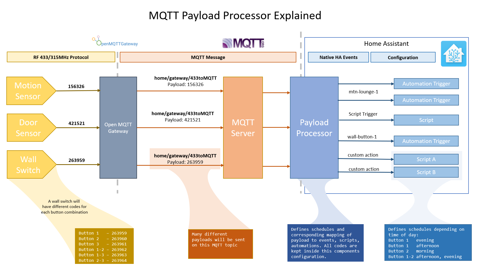

# Introduction
Custom Home Assistant component that converts MQTT message payloads to events and callback functions for consumption in automations. Provides a neat way to decouple implementation specific payloads (such as RF codes) from your Home Assistant configuration. Define schedule specific actions to execute when a device button is triggered.

## Use cases:

* **Gateway:** Acts as a gateway to convert RF codes (or other implementation specific identifier) to native Home Assistant events
* **Schedules:** reuse the same RF device (wall panel or remote control) to perform mulitple actions depending on some pre-defined schedule
* **Clean & Maintainable:** Store all RF specific integer codes in one location and use events as triggers in automations.
* **Post processing:** for payloads delivered by Open MQTT Gateway

## How does it work?



You need have some kind of device that emits __specific payloads__ on an MQTT topic that you want to convert to Home Assistant events. My use case is integration with OpenMQTTGateway where RF payloads are sent on a specific MQTT topic.

For example, an RF motion sensor, door sensor and wall button panel may send the following messages on `/rf/all`:

```
/rf/all 121330
/rf/all 163562
/rf/all 136566
```

Each payload is unique to a device. Some devices have multiple payloads.

This component allows you to name and define these devices (including their respective RF codes) in one central location. The rest of your Home Assistant configuration then refers to events and callback scripts instead. (This way your RF codes are not duplicated and used throughout the configuration.)

My examples are specific to RF devices, but you can use this component in any situation where implementation specific data is sent on an MQTT topic and you want to add a layer of abstraction on top of it.

# Getting Started
Installation with HACS is not possible due to HACS limitations. This component comes with a new domain and platform. The latter is not loaded with HACS.
Copy the folders in `custom_components` directory to the same directory in your Home Assistant configuration directory.

Then add the following to your configuration:
```yaml

processor:
  - platform: mqtt_code
    topic: /rf/all
    callback_script: script.buzz_short      # Global Callback (Executed disabled downstream)
    event: True                             # Global event flag, overwrites local (send HA events)
    entities: 
      - name: wallpanel-button-1
        type: button
        payload: 5842324
        callback_script: script.buzz_long
      - name: wallpanel-button-2
        type: button
        payloads_on: 
          - 5842324
          - 5842325
        payloads_off: 
          - 5842333
          - 5842334
        callback: False                     # Do not call global callback, True is default

```

This configuration listens for RF codes on the specified MQTT topic and generates events named after the `name` attribute when the corresponding payload is received. The `type` attribute only adds a custom icon in the event log for now. Supported options so far are `button` and `motion`.

You will likely have a large number of defined devices as they add up quickly. A three-button RF wall panel sends out 6 different codes depending on what combination of buttons is pressed. You can split your rf_code definition into a separate file like this:

```yaml 
processor:
  - platform: mqtt_code
    topic: /rf/all
    entities: !include rf_codes.yaml

```

Where the file has the following contents:

```yaml
- name: wp-lr-btn-1
  type: button
  payload: 5842324
- name: wp-lr-btn-2
  type: button
  payload: 5842322
```
# Configuration
**Device:** A high level device containing many entities. E.g. Wall panel with multiple buttons.
**Mapping** A button on a wall panel triggered by an MQTT payload. Contains many actions that define scripts for one or more schedules (including the `default` schedule).
**Schedule:** Defines when a certain set of actions is executed.


## Callback Scripts
You can define a script to be called as a sort of callback function. I use this to emit a short sound when specific buttons are pressed. (Sometimes the automation triggered by the button does not have immediate feedback). By default, the top level script is called if (and only if) the device declares `callback: true`.

You can define device-level callback scripts as well. Use the `callback` attribute to control whether or not the global callback script is executed when a local script is defined.
```yaml

processor:
  - platform: mqtt_code
    topic: /rf/all
    callback_script: script.buzz_short
    entities: 
      - name: wp-lr-btn-1
        type: button
        payload: 5842324
        callback: true        # uses global callback script
      - name: wp-lr-btn-2
        type: button
        payload: 5842322
        callback_script: script.custom_script
```

In addition to scripts, you can build automations that are triggered by the event emitted by the component when certain payloads are received. For example:

```yaml
- alias: WP BR Button 1
  hide_entity: yes
  trigger:
    platform: event
    event_type: wp-lr-btn-1
  action:
    - service: light.toggle
      entity_id:
        - light.living_room_floor_lamp
```

## Defining Actions
The following configuration shows how to assign a script action directly to the mapping.

```yaml
    - name: Black Button 
      type: panel
      mappings:
        button:
          payload: 1870753
          actions:
            default:
              - service: fan.toggle
                entity_id: fan.living_room_fan
```
## Scheduling
The component provides an advanced scheduling mechanism using schedules that change the functionality of a device button (`mapping`) depending on the schedule implementation. The design supports multiple schedule types, though only the `TimeSchedule` has been implemented so far. This leaves the possibility to define other schedule types in the future. For example, one that is active when a Home Assistant template condition evaluates to `true`.)

You can define any number of schedules, with or without overlapping times. If your schedules overlap, then both schedule scripts are triggered.

The default schedule will be executed if no other schedule is active or no other schedules are defined for the mapping. 

```yaml
processor:
  - platform: mqtt_code
    topic: /rf/all
    callback_script: script.buzz_short
    entities: !include rf_codes.yaml
    event: True
    entities:
      - name: Wall Button 
        type: panel
        schedules:
          morning:
            type: time
            start_time: '08:00:00'
            end_time: '08:00:00'
          evening:
            type: time
            start_time: '18:00:00'
            end_time: '23:00:00'
        mappings:
          button_1:
            payload: 1870753
            actions:
              morning:
                - service: light.toggle
                  entity_id: light.lounge_lamp
              evening:
                - service: media_player.pause
                  entity_id: media_player.tv
              default:
                - service: fan.toggle
                  entity_id: fan.bedroom_fan

```
## State Tracking
The component creates entities for each device defined in the configuration. An example state is shown below:
```json
{
    'last_triggered': '2018-11-27T10:47:10.640502', 
    'payload': '1268280', 
    'type': 'button', 
    'callback_script': 'script.buzz_short', 
    'global_callback': 'script.buzz_short'
}
```


# Future Enhancements
[x] Group multiple devices into larger entities representing the physical device.

# Automatic updates
Use the `custom_updater` component to track updates.
```yaml
custom_updater:
  track:
    - components
  component_urls:
    - https://raw.githubusercontent.com/danobot/mqtt_payload_processor/master/tracker.json
```

# Changelog
Refer to the `Changelog` file for detailed information.
